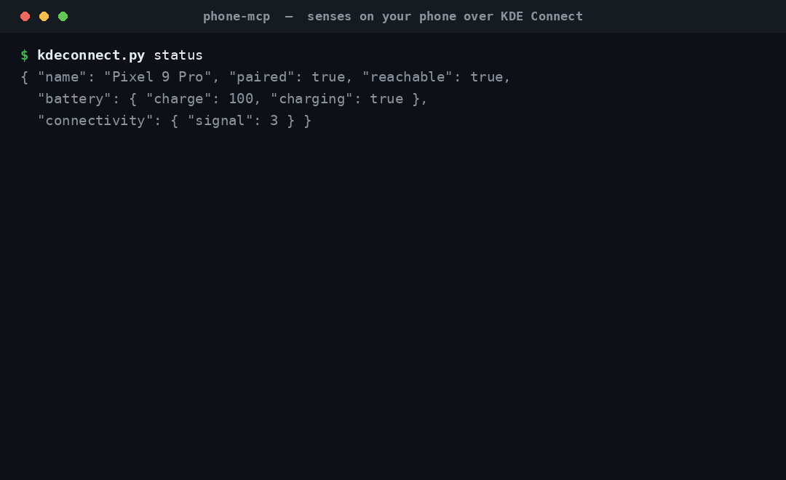

# phone-mcp — give your assistant senses on your phone

Give an AI assistant senses on your **phone** over **KDE Connect** — eyes
(camera), ears (notifications, now-playing), and a voice (SMS, typing, file
push, media control) — for hands-off bench work and remote control. Works with
any KDE Connect-paired device (developed and tested against a Pixel 9 Pro).



*Above: real `kdeconnect.py` runs — status, a ping, and pulling the newest
camera photo (an oscilloscope on the bench) to the host, all over the stable
KDE Connect link with no adb and no cable.*

KDE Connect is the whole transport: a persistent, cert-pinned link held warm by
the `kdeconnectd` daemon. Pair once on the phone and it survives drops and
reboots; each call is a fast local hop into the daemon — no rediscovery, no
toggling. (We deliberately do **not** use adb: it's flaky over Wireless
debugging and really an app-dev tool. Its only unique tricks — screencap of the
phone display and a raw shell — aren't what this is for.)

Two entry points share one `KDEConnect` class:

- **`kdeconnect.py`** — library + CLI.
- **`pixel_mcp.py`** — MCP server exposing the moves as `kde_*` tools.

## Setup

- `kdeconnect-cli` and `gdbus` on PATH (KDE Connect package, here 23.08).
- The MCP server needs the `mcp` Python package (present in `~/PY3`).

Pair once: on the **phone**, open **KDE Connect**, join the home Wi-Fi, and
accept the pairing request:

```bash
kdeconnect-cli --pair            # then tap Accept on the phone
python3 kdeconnect.py status     # sanity check: paired?, battery, signal
```

By default the first paired+reachable KDE Connect device is used. Targeting and
paths are environment-overridable: `KDECONNECT_NAME` (pin a device by name),
`KDECONNECT_DEVICE` (pin by id), `KDECONNECT_CLI`, `PIXEL_PULL_DIR` (default
`~/Pictures/pixel`).

## Standalone — CLI

| Verb | Purpose |
|---|---|
| `status` | device snapshot — paired?, reachable?, battery, connectivity |
| `devices` | list paired/reachable KDE Connect devices |
| `pair` | request pairing (Accept on the phone) |
| `pull` | pull newest (or named) camera photo to the host (over SFTP) |
| `photos` | list newest camera files (name, size, mtime) |
| `photo` | open the phone camera, wait for a shot, transfer it (needs camera permission) |
| `notifications` | list the phone's active notifications |
| `sms` | send an SMS (`message destination`) |
| `type` | type text into the phone's focused field (remote keyboard) |
| `share` | push a local file/URL to the phone |
| `clipboard` | send the desktop clipboard to the phone |
| `playing` | current media track + transport state |
| `players` | list available media players |
| `media` | media control (`play`/`pause`/`playpause`/`next`/`previous`/`stop`) |
| `ping` | buzz the phone (optional message) |
| `ring` | ring the phone loudly to locate it |

```bash
python3 kdeconnect.py status
python3 kdeconnect.py pull                    # newest camera photo -> ~/Pictures/pixel
python3 kdeconnect.py photos -n 5
python3 kdeconnect.py notifications
python3 kdeconnect.py sms "on my way" +15551234567
python3 kdeconnect.py type "hello from the desktop"
python3 kdeconnect.py share ~/Pictures/x.png
python3 kdeconnect.py ring
```

**Two ways to get "eyes":** `pull` grabs a photo you *already* shot (reads the
phone's camera folder over the SFTP plugin — the reliable everyday path, "took
a snap → look at it"). `photo` triggers a *fresh* on-demand capture by opening
the camera remotely; it needs the KDE Connect app to have Android **camera
permission** granted.

As a library:

```python
from kdeconnect import KDEConnect
kc = KDEConnect()
print(kc.status())
local = kc.photo()         # opens camera, returns the saved Path
kc.send_sms("hi", "+15551234567")
```

`status` / `battery` / `connectivity` are read from the `kdeconnectd` D-Bus
interface (via `gdbus`), since `kdeconnect-cli` has no flag for them; all
actions go through `kdeconnect-cli`.

## As an MCP server

`pixel_mcp.py` exposes the moves as MCP tools over stdio. Register with Claude
Code (or any MCP client):

```bash
claude mcp add pixel --scope user -- python3 /path/to/phone-mcp/pixel_mcp.py
# pin a specific paired device by name:
claude mcp add pixel --scope user --env KDECONNECT_NAME="My Phone" \
  -- python3 /path/to/phone-mcp/pixel_mcp.py
```

Tools: `kde_status`, `kde_pull`, `kde_photos`, `kde_photo`, `kde_notifications`,
`kde_send_sms`, `kde_send_text`, `kde_share`, `kde_clipboard`, `kde_ls`,
`kde_get`, `kde_put`, `kde_rm`, `kde_now_playing`, `kde_media_control`,
`kde_media_players`, `kde_ping`, `kde_ring`. The device snapshot is also a
read-only resource, `pixel://status`.

`kde_ls` / `kde_get` / `kde_put` / `kde_rm` are general file transfer over the
SFTP mount — list any directory, pull/push any file by path (relative to the
phone's internal storage), and delete. `kde_rm` is irreversible (no trash).

`kde_photo` returns the captured photo as an MCP **image**, so the model sees
the picture rather than only a file path. Every call rides the always-warm
daemon link.

## Permissions

A few plugins need Android permissions before their tools work: Notification
sync (`kde_notifications` + the media tools), Camera (`kde_photo`), Receive
remote keypresses (`kde_send_text`), and the SMS grants. Grant them by hand in
the KDE Connect app (tap the desktop → "Some Plugins need permissions"), **or**
run the optional one-time adb bootstrap:

```bash
scripts/setup-permissions.sh          # needs adb + a reachable device
ADB_SERIAL=<serial> scripts/setup-permissions.sh   # pick one of several devices
```

It's idempotent and non-destructive (it won't change your active keyboard). adb
is bootstrap-only here — the MCP transport stays KDE Connect. SMS, ping, ring,
share, SFTP pull/photos, and status/battery need no extra grants.

## Gotchas

- **KDE Connect must be open on the phone, on the home Wi-Fi, and paired** with
  this desktop, or calls report not-reachable. Pairing is one-time and persists
  across reboots.
- **`kde_photo` blocks** until the user takes the shot — tell them the camera
  is open and to snap it.
- **No phone-screen screencap and no raw shell** — KDE Connect can't do either.
  The camera is the eyes here, not the phone's own display.
- SMS goes over the phone's **real cellular line** — real messages, real
  recipients.
- `kde_photo` saves to `~/Pictures/pixel` (override `PIXEL_PULL_DIR`).
